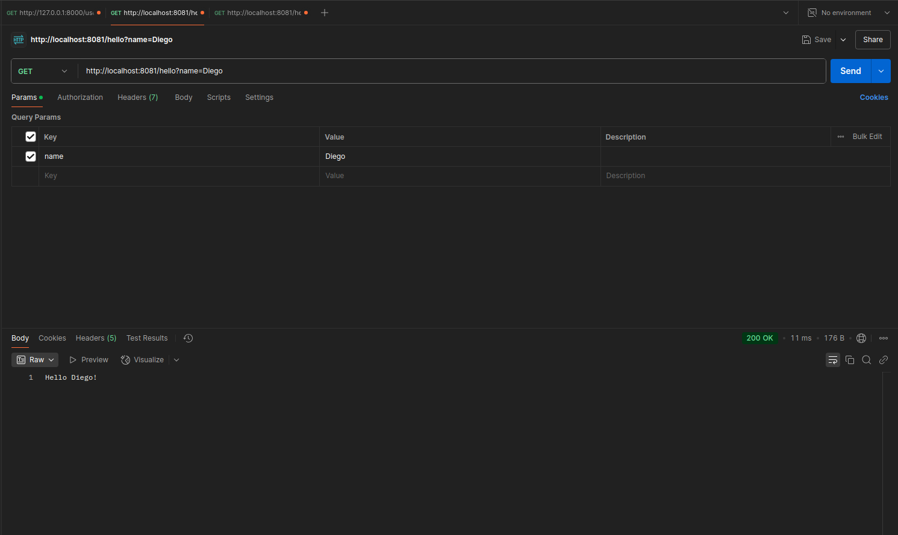

# Web API en Java
El siguiente proyecto lo realicé en base a SpringBoot. Fué probado usando postman. Los resultados se muestran en la imagen de más abajo. 

Se puede observar que el endpoint retorna:
- El nombre del usuario que se envía como parámetro (o 'World' por defecto).

El tutorial que seguí para obtener la primer API fue [https://spring.io/quickstart]() y luego [https://spring.io/guides/gs/spring-boot](). Después de editar el código se puede ejecutar el servidor usando el boton 'Play' en la extensión de SpringBoot. El próximo paso a realizar es completar es el tutorial [https://spring.io/guides/gs/rest-service]().