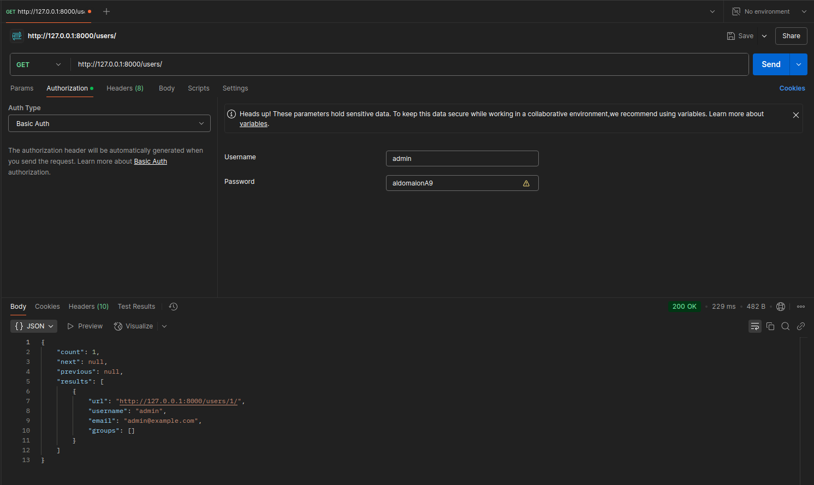

# Web API en Python
El siguiente proyecto lo realicé en base a Django y [www.django-rest-framework.org](). Fué probado usando postman. Los resultados se muestran en la imagen de más abajo. 



Se puede observar que el endpoint retorna:
- El nombre del usuario.
- El correo electrónico.
- Los grupos a los que el usuario pertenece.

El tutorial que seguí para obtener la primer API fue [https://www.django-rest-framework.org/tutorial/quickstart/](). Luego de editar el código se puede ejecutar el servidor usando ```python manage.py runserver```. El próximo paso a realizar es completar es el tutorial [https://www.django-rest-framework.org/tutorial/1-serialization/]().